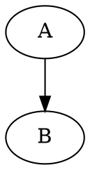

# DAGs

I find myself wanting to visualise a DAG.

I have quite a few concurrent projects at work. Many of these relate to each
other, but many stand alone. Some dependencies are hard, but most are soft.
Completing project X will make project Y easier. Project Z can be taken almost
to completion but not actually finished until Project A gets signed off.

"Normally", I'd put all these on a whiteboard and muck around until I was
satisfied. Unfortunately:

* I don't have a whiteboard near my desk
* Meeting rooms are very difficult to come by
* Some of the projects I'm working on are confidential

I think I'll get a few sheets of A3 paper and muck around at my desk, perhaps
with some Post-It notes.

However, if that doesn't work, I'd like to use graphviz. Writing DOT files is
easy, even if [the output isn't visually
appealing](https://www.kryogenix.org/days/2018/03/25/squares-and-prettier-graphs/).

I am perplexed as to why DOT files aren't more semantic. I'd _like_ to write:

That is, I'd like to specify classes for nodes and edges, much as one does
with HTML, and then to have a separate stylesheet to decide what each one
looks like.

I don't want to do this so I can outsource to a graphic designer (although
that would be nice), I want this so I don't have to make decisions about
visuals when I am really trying to make decisions about project structure.

I barely restrained myself from attempting such a thing this morning. If
anyone knows of something like this that *already exists*, please let me know.
